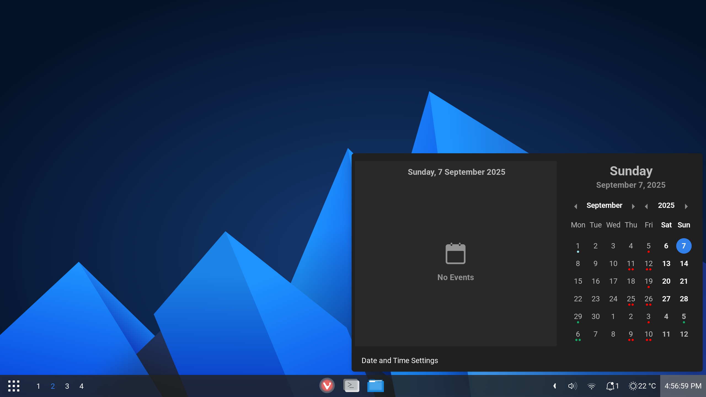
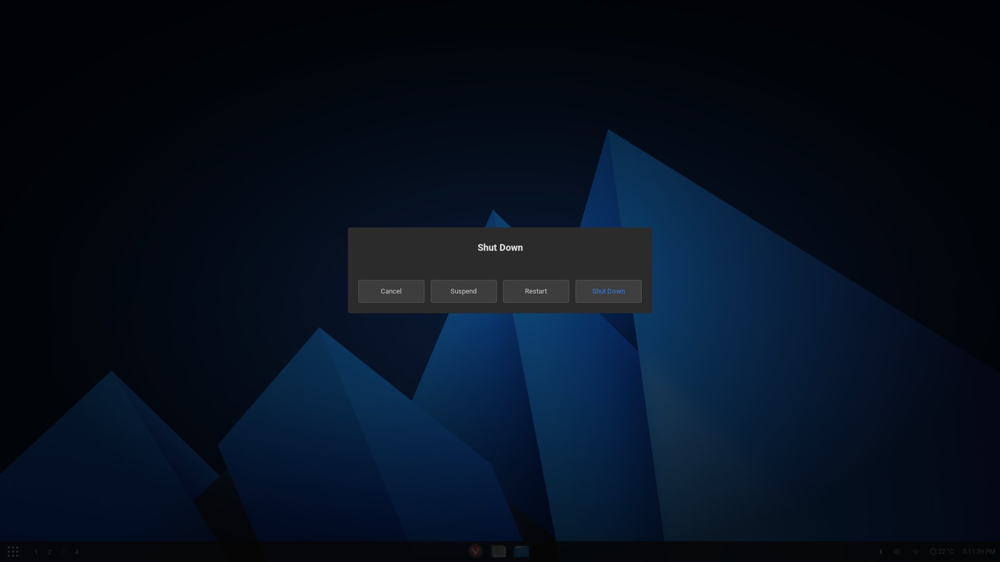
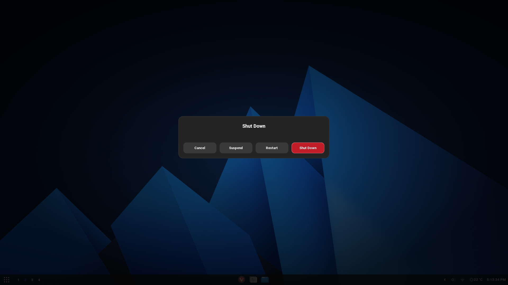

# A Fork of the Fluent theme
## Adds better cinnamon support to this theme

It adds 
- themed osd
- dialog/popups
- darker menus
- thinner font on panel

Just like in the gnome shell version

To install just overwrite the folders `cinnamon` and `gtk-3.0` into the themes folder of `Fluent-Dark` in `~/.themes`(make sure that you have install Fluent first!)

### Some screenshots

With

Without

## 

With

Without

